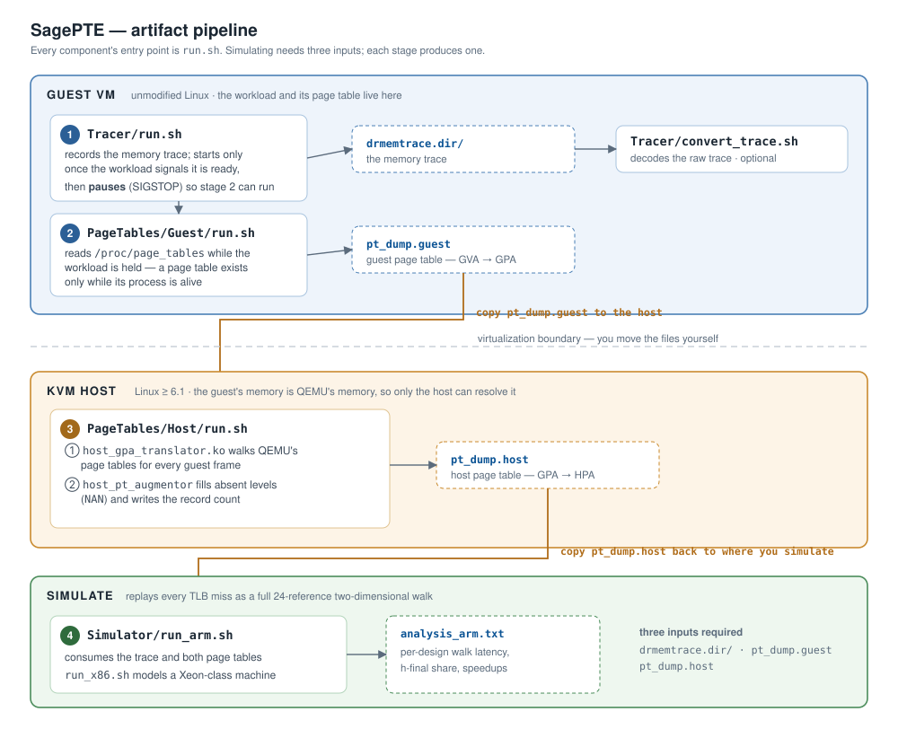

# SagePTE — Artifact

## For reviewers: one command

```bash
./run.sh redis
```

That is the whole evaluation. It builds the artifact if it has not been built,
traces the workload, captures the guest page table, produces the host page
table over SSH on the KVM host, decodes the trace, simulates it, and writes the
parsed result to `Results/redis/`. Nothing else needs to be run, and no step
needs to be supervised.

Substitute any workload from `./run.sh --list`, and add `arm` or `both` to
simulate a different machine (`x86` is the default). Every stage checks for its
own output first, so an interrupted run is resumed simply by repeating the
command.

It expects a QEMU/KVM host–guest pair, since the host page table can only be
produced on the host while the guest is running; `--host` and `--host-user`
point it at yours. Allow roughly seven hours for Redis, of which four are the
capture. To skip the capture and simulate the published dataset instead, see
[Simulate an existing dataset](#simulate-an-existing-dataset).

---

Evaluation artifact for **SagePTE**, a virtual-memory design for virtualized
systems that co-locates the guest and host page-table entries for a page inside
a single 128-bit extended PTE, so the hardware page walker can return a host
physical address at the guest leaf and skip the final host page-table
traversal entirely.

Under two-dimensional (nested) translation a TLB miss costs up to 24 sequential
memory references, and the cost is not evenly spread: the terminal Stage-2 walk
that resolves the *data* page — the **h-final phase** — accounts for up to 47%
of total walk latency, because it is indexed by the data page's guest-physical
address and therefore scales with the application's footprint rather than
staying warm in the page-walk caches. This artifact measures that phase and
what removing it is worth.

---

## What this repository contains

The **tooling**: a memory tracer, guest and host page-table dumpers, a
nested-page-walk simulator, and the workload definitions that drive them.

It does **not** contain the captured data. The Redis capture is 20 GB and
decodes to 106 GB, so traces and page-table dumps are published
separately (Zenodo; DOI assigned at camera-ready) and are re-creatable with the
tools here.

---

## The pipeline

<p align="center">
  
</p>

The simulator needs **three** inputs: the memory trace, the guest page table
(GVA→GPA) and the host page table (GPA→HPA). Each stage of the pipeline
produces one of them: it takes one input, runs one command, and leaves its
output in a known place. Every component's entry point is called `run.sh`.

| Stage | Where it runs | Produces |
| :-- | :-- | :-- |
| `Tracer/run.sh <workload>` | guest VM | `Data/<workload>/drmemtrace.dir/` |
| `PageTables/Guest/run.sh <workload>` | guest VM | `Data/<workload>/pt_dump.guest` |
| `PageTables/Host/run.sh <guest-pt>` | KVM host | `pt_dump.host` |
| `Simulator/run_x86.sh ../Data/<workload>` | guest VM | `Results/<workload>/analysis_x86.txt` |

---

## Quick start

### Build everything

One command installs the toolchain and compiles the tracer, the simulator, the
benchmarks and both page-table modules, in that order:

```bash
./build.sh                        # everything
./build.sh --only simulator       # enough to replay a published dataset
```

Anything that cannot be built on the current machine is reported and skipped
rather than failing the run — the kernel modules need matching headers, and the
host module needs Linux ≥ 6.1. Each step writes a log to `Logs/build/`, and a
step that fails for a recognised reason (a missing package or header, a stale
CMake cache) is repaired and retried automatically.

### Simulate an existing dataset

With a published dataset unpacked into `Data/`, this is the whole reproduction.
Capture needs a guest VM; replaying an existing dataset does not:

```bash
./build.sh --only simulator             # enough to replay
cd Simulator
./run_x86.sh ../Data/redis              # x86 configuration
./run_arm.sh ../Data/redis              # the paper's configuration
cat ../Results/redis/analysis_arm.txt   # written by the run
```

The two page-table dumps are located automatically beside the trace. The first
run decodes the raw capture, which for Redis takes about 11 minutes and expands
20 GB to 106 GB; every later run reuses it. A configuration then replays in
roughly 2.5 hours.

### Capture a workload yourself

Requires a QEMU/KVM host–guest pair, and key-based SSH from the guest to the
host. From inside the guest, this is the whole capture:

```bash
./run.sh redis              # trace, both page tables, decode, simulate
./run.sh redis both         # capture once, simulate x86 and arm
```

`run.sh` drives all five stages, including the trip to the KVM host: it copies
the guest page table up, runs the translation there over SSH, and brings the
result back. Point it elsewhere with `--host`, `--host-user` and `--host-repo`.
Every stage checks for its own output first, so an interrupted run is simply
re-run; `--force` redoes a stage that already finished. Because the trace and
the page tables do not depend on the modelled machine, naming a second
architecture repeats only the simulation.

The stages can equally be run by hand. Inside the guest, in two terminals:

```bash
# terminal 1 — record the trace; it pauses partway through
./Tracer/run.sh debug

# terminal 2 — capture the page table while the workload is held
./PageTables/Guest/run.sh debug
```

The tracer pauses on purpose. `/proc` exposes a process's page table only while
that process is alive, so the snapshot has to be taken *during* the run; the
workload is `SIGSTOP`ped at exactly the point where its page table is complete,
and resumed once you confirm. See `Tracer/README.md` for the reasoning.

Then, on the KVM host:

```bash
# translate GPA -> HPA
./PageTables/Host/run.sh ~/pt_dump.debug
```

Copy the result back into the guest:

```bash
scp ~/pt_dump.host  <user>@<guest>:/path/to/Data/debug/pt_dump.host
```

Then simulate, back in the guest:

```bash
cd Simulator && ./run_arm.sh ../Data/debug
```

---

## Layout

| Path | Contents |
| :-- | :-- |
| `Tracer/` | DynamoRIO fork whose `drcachesim` client can start recording on demand, plus `run.sh` and `convert_trace.sh`. See `Tracer/README.md`. |
| `PageTables/Guest/` | kernel module exporting `/proc/page_tables`, and the dumper that turns it into simulator input |
| `PageTables/Host/` | kernel module that walks QEMU's page tables (GPA→HPA), the augmentor that makes its output loadable, and the driver |
| `Simulator/` | DynamoRIO fork with a modified `drcachesim` that replays every TLB miss as a full 2D walk. See `Simulator/README.md`. |
| `Workloads/` | benchmarks (a fork of `mitosis-project/vmitosis-workloads`) and one declarative definition file per workload |
| `Lib/ui.sh` | shared terminal presentation layer used by all the scripts |

### Adding a workload

Copy `Workloads/_template.sh` to `Workloads/<name>.sh`, set the binary,
arguments and readiness signal, and it is immediately runnable as
`./Tracer/run.sh <name>`. No script needs editing.

---

## Requirements

| | |
| :-- | :-- |
| Simulation only | Linux x86-64, gcc/g++ 7, CMake ≥ 3.2, Python 3 |
| Capture | a QEMU/KVM host–guest pair, kernel headers, root in both |
| Host page tables | **Linux ≥ 6.1** on the KVM host — the module uses the maple-tree VMA iterators (`VMA_ITERATOR`, `for_each_vma`) |
| Disk | traces are large: ~19 GB raw per workload, ~9× that once decoded |

`./build.sh` installs the toolchain on Ubuntu and then builds everything;
`./build.sh --only deps` stops after the toolchain. (`install_deps.sh` still
works and now forwards to it.)

> **Note on AVX-512.** The bundled DynamoRIO (7.0.0) predates AVX-512 and
> crashes at startup on machines that expose it: the kernel writes a 2440-byte
> XSTATE into a 832-byte buffer during signal initialisation. Disable it for the
> VM — `-cpu host,-avx512f,-avx512dq,-avx512cd,-avx512bw,-avx512vl,-avx512ifma,-avx512vbmi`
> — or via `clearcpuid=` on the guest kernel command line.

---

## Licensing and attribution

This repository aggregates several upstream projects; each retains its own
licence, and those notices are kept intact.

| Component | Origin | Licence |
| :-- | :-- | :-- |
| `Tracer/`, `Simulator/` | [DynamoRIO](https://dynamorio.org) | BSD — see `License.txt` in each |
| `Workloads/` | [vmitosis-workloads](https://github.com/mitosis-project/vmitosis-workloads) and the benchmarks it packages (Redis, Graph500, XSBench, Canneal/PARSEC, BTree, GUPS, STREAM) | per-benchmark; see each subdirectory |
| `PageTables/*/` kernel modules | this work | GPLv2, as required for Linux modules |
| Scripts, workload definitions, `Lib/` | this work | same terms as the artifact |

The comparison designs evaluated alongside SagePTE — ASAP, Agile Paging, DMT,
ECPT, FPT and TPT — are prior work by their respective authors and are cited in
the paper; this repository contains only our own re-implementation of their
page-walk cost models, in `Simulator/scripts/parse_walk_stats.py`.
